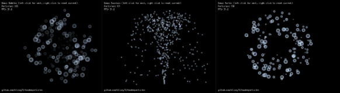

  

twodeeparticles
===============

**An engine-agnostic 2D particle system simulator for Go**

twodeeparticles does not render particles itself. Any rendering engine can be used, for example [Ebiten].
For a demo program using Ebiten, see [cmd/demo](https://github.com/blizzy78/twodeeparticles/tree/master/cmd/demo).

License
-------

twodeeparticles is licensed under the MIT license.

[Ebiten]: https://ebiten.org/
